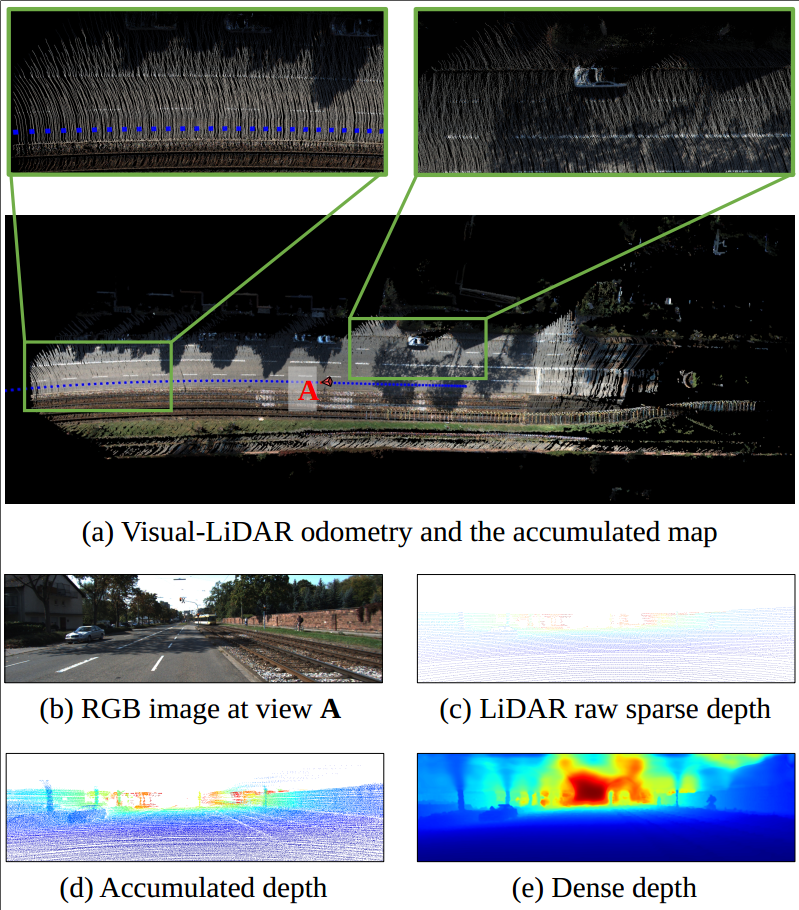

# SelfCompDVLO-pytorch

This repository contains a reference implementation of the algorithms described in our paper (submitted to IEEE TVT) ["Self-supervised Depth Completion from Direct Visual-LiDAR Odometry in Autonomous Driving"]().


## Introduction
In this paper, we present a feature-based direct visual-LiDAR odometry method, which integrates a deep neural network and a conventional non-linear optimization algorithm to achieve precise ego-motion estimation. Upon this, we further train another neural network for completing sparse LiDAR measurements to a dense depth map of the surrounding scenes. This is significant because the ego-motion and the environmental depth perception are both critical functions for self-driving cars.


- A visual illustration of this task is as below:
 


Our model generates the dense depth map (e) from the RGB image (b) and the raw sparse depth (c). Compared to the depth map (d), which is directly accumulated from previous frames using the odometry results, (e) is denser and unaffected by the cumulative error and dynamic objects. Moreover, depth completion can achieve more details of the scene, which contributes to the scene understanding tasks afterward.

## Dataset
- KITTI VO and KITTI depth dataset, download [here](http://www.cvlibs.net/datasets/kitti/index.php)
1. KITTI VO data structure
```
root_dir
|--pose
   |--00.txt
   |--...
|--sequences
   |--00
      |--image_2
         |--000000.png
         |--...
      |--velodyne
         |--000000.bin
         |--...
      |--calib.txt
      |--times.txt
   |--...
```
2. KITTI depth data structure
```
root_dir
|--calib
|--depth_selection
|--rgb_data
   |--train
   |--val
|--train
|--val
```
## Quick Start.

### Install Dependencies
#### python
- PyTorch>=1.0
- numpy
- [liegroups](https://github.com/utiasSTARS/liegroups)
#### C++
- [ceres](https://github.com/ceres-solver/ceres-solver.git)
- [Sophus](https://github.com/strasdat/Sophus.git)
- [pybind11](https://github.com/pybind/pybind11.git)

### Install ceres-python
```
cd models/ceres-python
python setup.py install
```

### Test the visual-LiDAR odometry
We provide an ceres implementation of feature-based direct Gauss-Newton optimizer. Install 'ceres-python' first, then run the following script:
```
python test_odometry_opt.py --test_data_dir data/filenames/10.txt --root_dir dataset_root_dir
```
Note: the python-version optimizer and the corresponding test script will be released after the paper publication.

### Test the depth completion 
```
python test_depthcomp.py --val_data_dir data/filenames/depth_vals.txt --root_dir dataset_root_dir
```

### Pre-trained Models
Download the pre-trained models [here](https://drive.google.com/file/d/1ZhrmjPFwb9sgBRSD-4FHXnSQbrhjXFuu/view?usp=sharing). 
Then unzip the pre-trained model to folder 'results'.

Note: The model is trained using KITTI dataset 

## Citation
If you use this code/model for your research, please cite the following paper:
```
coming soon...
```


## References
The code refers to the ['sparse-to-dense'](https://github.com/fangchangma/sparse-to-dense)

